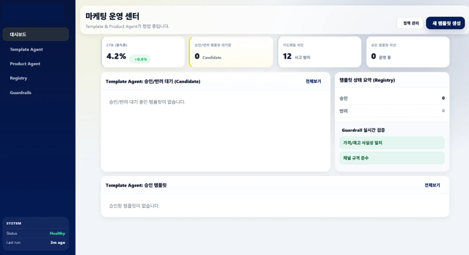
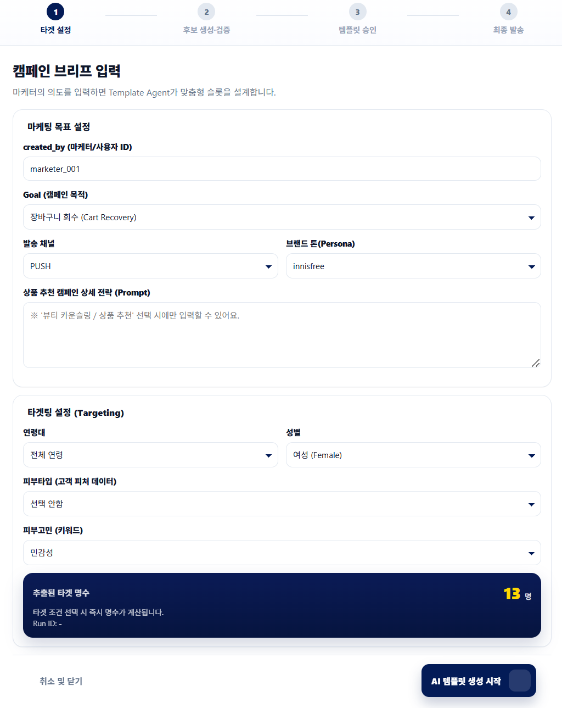
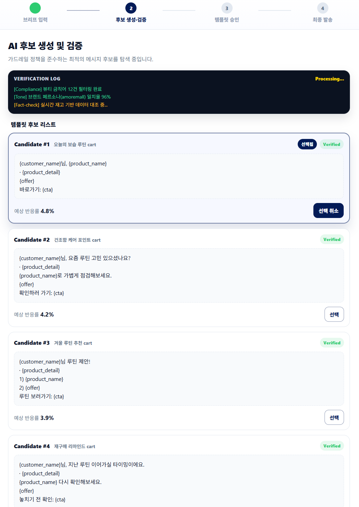
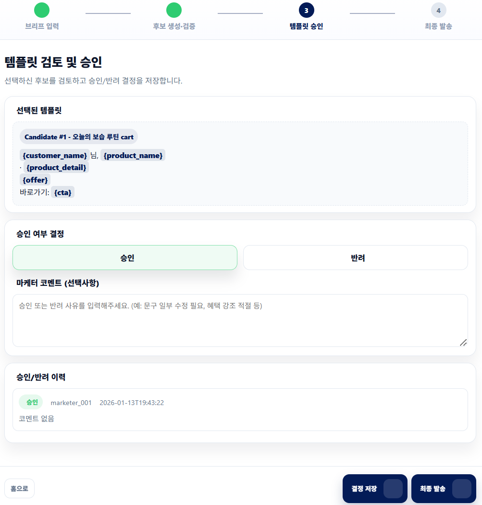
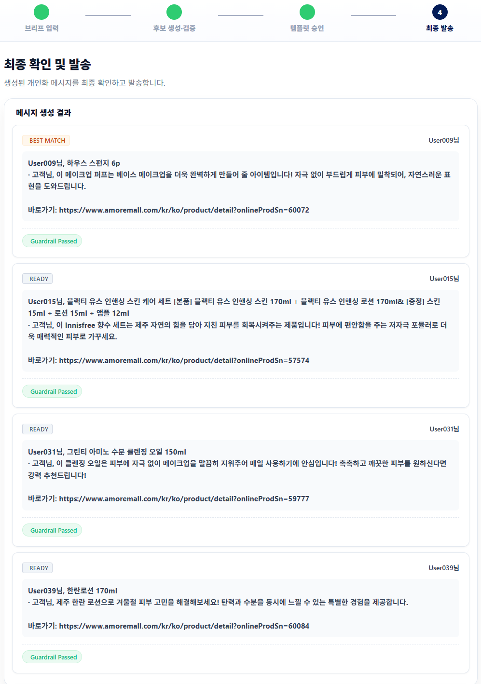
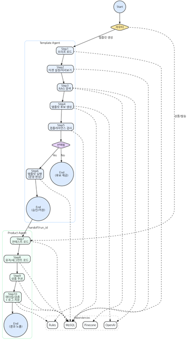
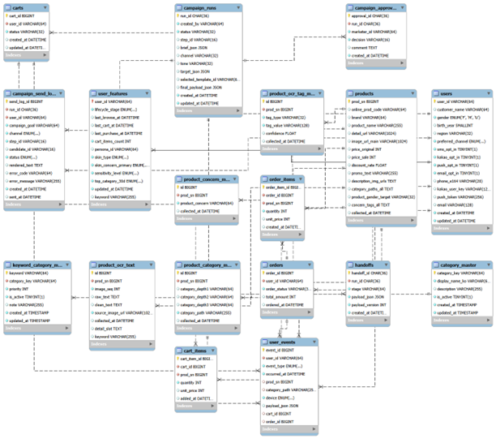

# AMORE CRM 2-Agent (Template Agent + Product Agent)

마케터가 **CRM 메시지를 빠르고 안전하게** 만들고 운영할 수 있도록 돕는 2-Agent 시스템입니다.  
Template Agent가 **템플릿 후보 생성·컴플라이언스 검증·승인(HITL)** 을 담당하고, Product Agent가 **상품 추천·슬롯 채움·최종 렌더링·발송 로그**를 담당합니다.

---

## 1) What this solves

CRM 운영에서 반복적으로 발생하는 문제를 해결합니다.

- **속도**: 브리프 작성 → 후보 생성/비교 → 승인까지의 리드타임 단축
- **안전성**: 컴플라이언스(PASS/WARN/FAIL) 기반 가드레일로 리스크 사전 차단
- **운영성**: 승인/근거/룰 결과/발송 상태를 DB에 저장하여 재현·감사 가능
- **확장성**: 생성(Template)과 실행(Product)을 분리해 추천/채널/실험(A/B) 고도화 용이

---

## 2) Core features

### Template Agent (LangGraph)
- Step1 브리프 로드
- Step2 타겟 설정/미리보기(페르소나/세그먼트)
- Step3 RAG 검색(Pinecone)
- Step4 템플릿 후보 생성(OpenAI)
- Step5 컴플라이언스 검사(Rule Validator)
- Step6 승인된 템플릿 실행/저장(handoff)

### Product Agent (LangGraph)
- Step7 컨텍스트 로드(handoff/run_id)
- Step8 유저/세그먼트 로드(DB)
- Step9 상품 추천(DB/카탈로그)
- Step10 슬롯 채움/검증 + 발송 로그 저장

### UI/UX (Streamlit MVP)
- 3-step 위저드(브리프 → 후보/검증 → 승인)
- 후보 카드 비교 + 슬롯 하이라이트({고객명},{상품명}…)
- Verification Log(검증 과정 가시화)
- 승인/반려 + 히스토리 저장(운영 추적)

### Preview(Screenshots)






---

## 3) Architecture

- **UI**: Streamlit
- **Orchestration**: LangGraph (Template Agent / Product Agent)
- **DB**: MySQL (runs/handoffs/approvals/send_logs + users/user_features + products)
- **RAG**: Pinecone
- **LLM**: OpenAI
- **Validation**: Rule Validator (PASS/WARN/FAIL)

- LangGraph
- DB

---

## 4) Quickstart (Local)

### 4-1. Requirements
- Python 3.10+ (권장)
- Docker / Docker Compose
- OpenAI API Key
- Pinecone API Key (+ Index)

### 4-2. Environment variables
프로젝트 루트에 `.env` 생성:

```bash
# OpenAI
OPENAI_API_KEY=YOUR_KEY

# Pinecone
PINECONE_API_KEY=YOUR_KEY
PINECONE_INDEX_NAME=YOUR_INDEX

# MySQL (docker-compose 기준)
MYSQL_HOST=127.0.0.1
MYSQL_PORT=3306
MYSQL_DATABASE=crm
MYSQL_USER=crm
MYSQL_PASSWORD=crm_pw
MYSQL_ROOT_PASSWORD=root_pw
